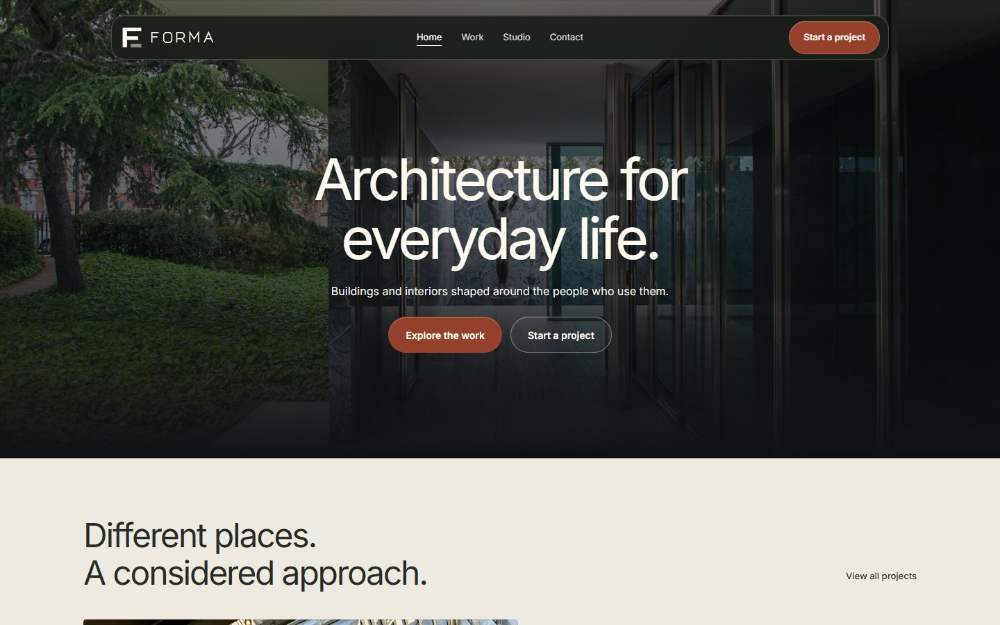

# Forma Studio



A responsive architecture and interiors website with a filterable portfolio, individual project studies and a local inquiry preview. Forma Studio and its projects are fictional. Photography illustrates the concepts and does not represent work completed by a real practice.

## Run locally

Use Node.js 22.12 or newer and pnpm 11.19.0.

```sh
pnpm install --frozen-lockfile
pnpm dev
```

The development server binds to `127.0.0.1`. Open the local address printed by Vite.

```sh
pnpm format:check
pnpm lint
pnpm build
pnpm preview
```

The build type-checks the source, renders every public route to HTML, and creates Brotli and gzip alternatives for text assets. The preview server serves those files with matching content types and returns a dedicated 404 page for unknown addresses.

## Structure

- `src/pages` contains the home, portfolio, project, studio and inquiry views.
- `src/components` contains shared navigation, images and accessible selectors.
- `src/data` holds the typed project collection and photo attribution records.
- `src/lib` contains route metadata and hydration utilities.
- `scripts` contains the static rendering and compression pipeline.
- `public/images` contains responsive WebP photographs.

The interface uses React 19, TypeScript, React Router, Vite 7, Tailwind 3 with custom CSS, and Radix Select. Inter is self-hosted through Fontsource. The lockfile preserves exact dependency resolutions; the package policy requires a seven-day release age for new resolutions.

## Interaction and privacy

The project filters, mobile navigation, service links and inquiry validation work locally. The inquiry form never sends a request or writes to browser storage. It is disabled until its local submit handler is ready. Example inputs remain in memory until the route is left or the page reloads.

No analytics, cookies, backend, email service or deployment integration is configured. The pages use `noindex, nofollow` while the site remains a fictional portfolio example.

## Assets and rights

See [ASSET_LICENSES.md](ASSET_LICENSES.md) for original photographs, licenses, transformations and font credits. The Photo credits page presents the image attribution in the interface. Original code and copy are reserved under [LICENSE.md](LICENSE.md); third-party assets retain their own terms.
